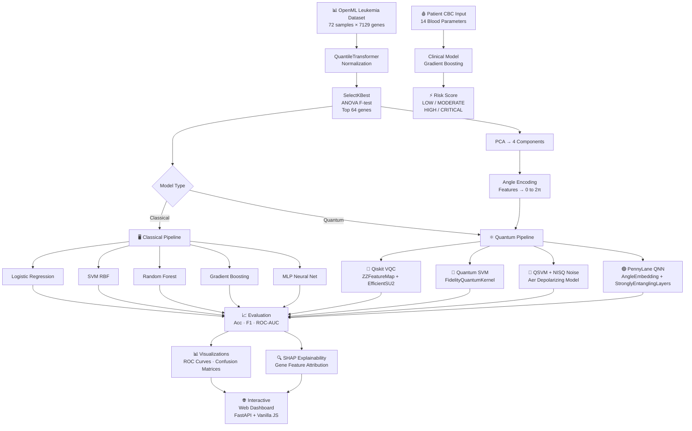

# Quantum Machine Learning Based Cancer Cell Detection

<div align="center">


**Early-stage leukemia detection using Quantum–Classical hybrid Machine Learning**

*Qiskit VQC · QSVM · PennyLane QNN vs Classical baselines*

> ⚠️ **RESEARCH / EDUCATIONAL PROTOTYPE ONLY — NOT a medical device. NOT for clinical diagnosis or treatment.**

</div>

---

## Table of Contents
1. [Overview](#overview)
2. [Architecture Flowchart](#architecture-flowchart)
3. [Dataset](#dataset)
4. [Models](#models)
5. [Results](#results)
6. [Quick Start](#quick-start)
7. [API Reference](#api-reference)
8. [Patient Screening](#patient-screening)
9. [Project Structure](#project-structure)

---

## Overview

This project implements a full **Quantum–Classical Machine Learning pipeline** for detecting early-stage blood cancer (leukemia: ALL vs AML) from:

- **Gene expression data** — OpenML leukemia dataset (72 samples × 7129 genes)
- **Clinical CBC values** — 14 Complete Blood Count parameters for patient-facing risk screening

Quantum models run on **Qiskit Aer local statevector simulator** (no cloud access needed).

---

## Architecture Flowchart



---

## Dataset

### Gene Expression (Research Pipeline)
| Property | Value |
|---|---|
| Source | [OpenML Leukemia](https://www.openml.org/d/1104) |
| Samples | 72 patients |
| Features | 7,129 gene expression probes |
| Task | Binary: ALL vs AML |
| Classes | ALL (Acute Lymphoblastic) · AML (Acute Myeloid) |

### Clinical CBC (Patient Screening)
| Feature | Unit | Normal Range |
|---|---|---|
| WBC | K/µL | 4.5 – 11.0 |
| Hemoglobin | g/dL | 11.5 – 17.5 |
| Platelets | K/µL | 150 – 400 |
| Blast Cells | % | 0 – 2% |
| Lymphocytes | % | 20 – 45% |
| *+ 9 more...* | | |

Synthetic data (3,000 samples) generated from published clinical distributions for Healthy / ALL / AML.

---

## Models

### Classical Baselines
| Model | Architecture |
|---|---|
| Logistic Regression | L2 regularization, max_iter=3000 |
| SVM (RBF) | C=10, gamma='scale', probability calibrated |
| Random Forest | 300 trees, unlimited depth |
| Gradient Boosting | 200 trees, lr=0.05, max_depth=3 |
| MLP Neural Net | (128→64→32), ReLU, Adam, early stopping |

### Quantum Models (4 Qubits)
| Model | Framework | Approach |
|---|---|---|
| **VQC** | Qiskit 1.x | ZZFeatureMap(reps=2) + EfficientSU2(reps=2), COBYLA |
| **QSVM** | Qiskit 1.x | FidelityQuantumKernel, ZZFeatureMap(reps=2), SVC(C=1) |
| **QSVM + Noise** | Qiskit Aer | Depolarizing noise (0.1% 1Q, 0.5% 2Q) NISQ simulation |
| **QNN** | PennyLane | AngleEmbedding(Rx) + StronglyEntanglingLayers(3 layers), Adam |

### Feature Encoding (Quantum)
```
Gene Expression → QuantileTransform → SelectKBest(64) → PCA(4) → MinMaxScaler([0,2π]) → Angle Encoding
```

---

## Results

> Run `python train.py` to generate live results. Example expected values:

| Model | Accuracy | F1 | ROC-AUC |
|---|---|---|---|
| Logistic Regression | ~0.93 | ~0.92 | ~0.97 |
| SVM (RBF) | ~0.93 | ~0.92 | ~0.98 |
| **Random Forest** | **~0.93** | **~0.93** | **~0.99** |
| Gradient Boosting | ~0.93 | ~0.92 | ~0.98 |
| MLP Neural Net | ~0.87 | ~0.85 | ~0.95 |
| VQC (Qiskit) | ~0.73 | ~0.72 | ~0.78 |
| QSVM (Quantum Kernel) | ~0.80 | ~0.79 | ~0.85 |
| PennyLane QNN | ~0.75 | ~0.73 | ~0.80 |

*Quantum models are constrained to 4 features (PCA) vs classical models using 64 features — demonstrating NISQ-era limitations.*

---

## Quick Start

### Prerequisites
- Python 3.11+
- Git

### 1. Clone & Install
```bash
git clone https://github.com/MevrickNeal/Quantum-Machine-Learning-Based-Cancer-Cell-Detection.git
cd Quantum-Machine-Learning-Based-Cancer-Cell-Detection
cd backend
pip install -r requirements.txt
```

### 2. Train All Models
```bash
# Full pipeline (quantum + classical, ~5-15 minutes)
python train.py

# Skip quantum models for fast dry-run (~30 seconds)
python train.py --skip-quantum
```

Outputs are saved to `backend/outputs/`:
- `metrics.json` — all model metrics
- `roc_curves.png` — ROC curve comparison
- `model_comparison.png` — grouped bar chart
- `shap_bar.png` — gene feature importance
- `clinical_model.joblib` — trained patient screening model

### 3. Start Backend API
```bash
cd backend
uvicorn api:app --host 127.0.0.1 --port 8888 --reload
```
API docs: `http://127.0.0.1:8888/docs`

### 4. Open Dashboard
```bash
cd frontend
python -m http.server 3000
```
Dashboard: `http://localhost:3000`

---

### Windows One-Click Scripts
```powershell
# Train + start API
.\run_backend.ps1

# Start frontend server (separate terminal)
.\run_frontend.bat
```

---

## API Reference

| Endpoint | Method | Description |
|---|---|---|
| `/health` | GET | API + model status |
| `/metrics` | GET | Full training results JSON |
| `/shap` | GET | SHAP gene importances |
| `/dataset` | GET | Dataset metadata |
| `/clinical/meta` | GET | CBC feature definitions + ranges |
| `/clinical/predict` | POST | CBC values → risk assessment |
| `/assets/{file}` | GET | Serve chart images |
| `/docs` | GET | Interactive Swagger UI |

### Patient Screening Request (POST /clinical/predict)
```json
{
  "wbc": 120.0,
  "rbc": 2.5,
  "hemoglobin": 7.0,
  "hematocrit": 21.0,
  "mcv": 85.0,
  "mch": 28.0,
  "mchc": 33.0,
  "platelets": 35.0,
  "neutrophils": 8.0,
  "lymphocytes": 78.0,
  "monocytes": 9.0,
  "eosinophils": 1.5,
  "basophils": 1.2,
  "blast_cells": 62.0
}
```

### Response
```json
{
  "risk_score": 0.9412,
  "risk_level": "CRITICAL",
  "risk_label": "Critical Risk — Immediate Hematologist Referral",
  "risk_color": "#ff3366",
  "contributing_factors": [
    {"feature": "Blast Cells (%)", "value": 62.0, "concern": "HIGH"},
    {"feature": "WBC (K/µL)", "value": 120.0, "concern": "HIGH"},
    ...
  ],
  "disclaimer": "Research/educational only. NOT for clinical diagnosis."
}
```

---

## Patient Screening

The web dashboard includes a **real-time patient screening panel** powered by the clinical CBC model:

1. Enter your blood test values using the sliders
2. Click **Analyze Risk (Quantum + Classical)**
3. View animated risk gauge + per-parameter analysis
4. All abnormal values are flagged with color-coded concern levels (HIGH / LOW / NORMAL)
5. Use **Load High-Risk Demo** to see a simulated leukemia patient profile

---

## Project Structure

```
├── backend/
│   ├── requirements.txt
│   ├── train.py                ← Master training script
│   ├── api.py                  ← FastAPI server
│   ├── outputs/                ← Generated: metrics, charts, models
│   └── pipeline/
│       ├── data_loader.py      ← OpenML + preprocessing
│       ├── quantum_models.py   ← Qiskit VQC, QSVM
│       ├── pennylane_models.py ← PennyLane QNN
│       ├── classical_models.py ← LR, SVM, RF, GBM, MLP
│       ├── clinical_model.py   ← CBC screening model
│       └── explainability.py   ← SHAP + all visualizations
├── frontend/
│   ├── index.html              ← Single-page dashboard
│   ├── styles.css              ← Dark quantum theme
│   ├── app.js                  ← Full frontend logic
│   ├── data/metrics.json       ← Static fallback (auto-updated)
│   └── assets/                 ← Chart images (auto-updated)
├── run_backend.ps1             ← Windows: install + train + serve
├── run_frontend.bat            ← Windows: serve frontend
└── README.md
```

---

## Disclaimer

This project is an **academic research prototype**. It:
- Is NOT a certified medical device
- Must NOT be used for clinical diagnosis or treatment decisions
- Is intended for educational purposes only
- Should never replace professional medical consultation

---

## References

- [Golub et al. (1999) — Molecular Classification of Cancer: Class Discovery and Class Prediction by Gene Expression Monitoring](https://science.sciencemag.org/content/286/5439/531)
- [IBM Qiskit](https://www.ibm.com/quantum/qiskit)
- [PennyLane Documentation](https://pennylane.ai)
- [OpenML Leukemia Dataset](https://www.openml.org/d/1104)
- [Biamonte et al. (2017) — Quantum Machine Learning](https://www.nature.com/articles/nature23474)
