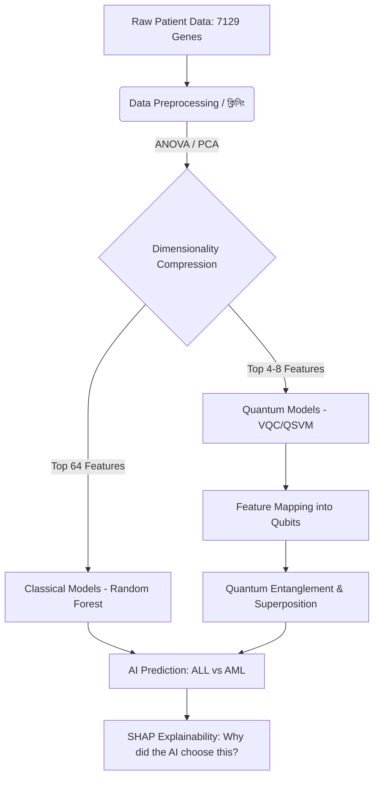
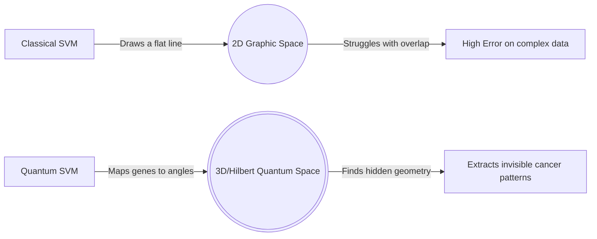

# 🏆 LeukoQ: Ultimate Concept Training & Stage Matrix

This document is designed for **deep conceptual learning**. To dominate on stage and handle both **High Professionals (Judges/Experts)** and the **General Public**, your team must understand the *Why* and *How* behind every technology used. 

For every single concept, we will provide:
1. **The Layman Explanation:** For the general public (Class 8 biology level).
2. **The Professional Explanation:** For the expert judges (University/Research level).
3. **The Bangla Translation:** Allowing fluid, bilingual stage presence.

---

## 🧬 Section 1: Biology & Chemistry (The Medical Foundation)

Before the AI can do its job, we must understand the disease we are fighting.

### Concept 1.1: Blood Composition & Leukemia (রক্ত এবং লিউকেমিয়া)

*   **Layman (Public):** "Our blood has red cells to carry oxygen and white cells to fight disease. Our bones act like factories making these cells. In **Leukemia**, the factory breaks. It starts mass-producing broken, useless white cells that crowd out the good ones."
*   **Professional (Judge):** "Leukemia is a malignancy of the hematopoietic (blood-forming) stem cells in the bone marrow. It causes the uncontrolled proliferation of 'blast cells' that fail to differentiate into mature leukocytes, leading to bone marrow failure."
*   **Bangla (বাংলা):** "আমাদের শরীরে হাড়ের ভেতরের মজ্জা (Bone Marrow) হলো রক্ত তৈরির কারখানা। লিউকেমিয়া হলো সেই কারখানার একটি ক্যানসার। এর ফলে শরীর প্রচুর পরিমাণে অকেজো শ্বেত রক্তকণিকা তৈরি করতে থাকে। এই অকেজো কোষগুলো ভালো কোষগুলোর জায়গা দখল করে নেয়, ফলে শরীর রোগ প্রতিরোধ ক্ষমতা হারায়।"

### Concept 1.2: ALL vs. AML (দুটি প্রধান লিউকেমিয়া সাব-টাইপ)

*   **Layman:** "There are two main types here: ALL usually affects kids, while AML usually affects adults. They stem from two different 'branches' of the blood factory."
*   **Professional:** "Our model classifies between Acute Lymphoblastic Leukemia (ALL)—arising from the lymphoid lineage—and Acute Myeloid Leukemia (AML)—arising from the myeloid lineage. Distinguishing these perfectly is crucial because their chemotherapy protocols are completely different."
*   **Bangla:** "লিউকেমিয়া সাধারণত দুই ধরনের কোষে হতে পারে: **ALL (Acute Lymphoblastic Leukemia)** যা লিম্ফোয়েড লাইন থেকে আসে (বাচ্চাদের বেশি হয়), এবং **AML (Acute Myeloid Leukemia)** যা মায়েলয়েড লাইন থেকে আসে। আমাদের মডেল এই দুই প্রকারের মধ্যে একদম নিখুঁত পার্থক্য করতে পারে।"

### Concept 1.3: DNA & Gene Expression (ডিএনএ এবং জিনের ভাষা)

*   **Layman:** "DNA is the instruction manual of our body. **Gene expression** is how loudly a specific instruction is being shouted. If a cancer-causing gene is 'shouting' too loudly, the cell becomes a cancer cell."
*   **Professional:** "We use Transcriptomics. The dataset (Golub et al.) contains microarray data mapping the mRNA expression levels of **7,129 separate genes**. By analyzing these expression levels, we create a multidimensional topological map of the disease."
*   **Bangla:** "DNA হলো আমাদের শরীরের ব্লু-প্রিন্ট বা নির্দেশিকা। **Gene Expression (জিন এক্সপ্রেশন)** হলো প্রোটিন তৈরির মাধ্যমে সেই নির্দেশাবলি কাজে লাগানোর প্রক্রিয়া। আমাদের ডেটাসেটে ৭১২৯ টি জিনের এক্সপ্রেশন বা সিগন্যাক ক্যাপচার করা হয়েছে। এই সিগন্যালগুলো পড়েই কোয়ান্টাম মডেল বুঝতে পারে কে ক্যানসারে আক্রান্ত আর কে সুস্থ।"

---

## 💻 Section 2: Classical Machine Learning (ML)

### Concept 2.1: How ML actually learns (মেশিন লার্নিং কীভাবে শেখে)

*   **Layman:** "Normally, programmers write rules like 'IF gene > 10, print Cancer'. But biology is too complex. Machine Learning does the reverse: we give it thousands of patient records, and the computer *figures out* the rules itself."
*   **Professional:** "Machine Learning optimizes a mathematical loss function. By exposing algorithms (like Random Forest) to labeled training data (Supervised Learning), the algorithm maps a complex decision boundary across 7,129 dimensions to separate AML from ALL."
*   **Bangla:** "সাধারণ প্রোগ্রামিং-এ আমরা কম্পিউটারকে কিছু নির্দিষ্ট নিয়ম ঠিক করে দিই। কিন্তু মেশিন লার্নিং-এ আমরা কোনো নিয়ম তৈরি করি না; বরং কম্পিউটারকে প্রচুর ডেটা দিই। অ্যালগরিদম সেই ডেটা পড়ে নিজেই এমন গাণিতিক সূত্র (Mathematical Model) তৈরি করে যা ক্যানসারের প্যাটার্ন চিনতে পারে।"

---

## ⚛️ Section 3: The Physics (Quantum Fundamentals)

This is the hardest part. The team must sound confident here.

### Concept 3.1: Qubits and Superposition (কিউবিট এবং সুপারপজিশন)

*   **Layman:** "A normal computer uses 'Bits' like a light switch—it's either ON (1) or OFF (0). A Quantum computer uses 'Qubits', which are like a spinning coin. While spinning, it is Heads AND Tails at the exact same time. This is called **Superposition**. It lets the computer look at many answers at once."
*   **Professional:** "A classical bit is binary. A qubit leverages quantum superposition, allowing it to exist in a linear combination of states ($|0\rangle$ and $|1\rangle$). Mathematically, this means a register of $N$ qubits can represent and compute across $2^N$ states simultaneously in a high-dimensional vector space."
*   **Bangla:** "সাধারণ কম্পিউটারের 'বিট' শুধু ০ বা ১ হতে পারে। কিন্তু কোয়ান্টাম কম্পিউটারের 'কিউবিট' (Qubit) একই সাথে ০ এবং ১ দুই অবস্থাতেই থাকতে পারে। একে বলা হয় **সুপারপজিশন (Superposition)**। এর ফলে, কোয়ান্টাম মডেল একই সাথে লক্ষাধিক হিসাব করতে পারে, যা সাধারণ কম্পিউটারের পক্ষে অসম্ভব।"

### Concept 3.2: Entanglement (এন্ট্যাঙ্গেলমেন্ট)

*   **Layman:** "If I have two magic dice, and I roll a 'six' in Dhaka, my friend's magic die in New York instantly rolls a 'six' too. They are connected invisibly. This is **Entanglement**."
*   **Professional:** "Entanglement occurs when quantum states of two or more particles cannot be described independently. In our Quantum Circuits (like the `ZZFeatureMap`), we entangle qubits so the model can natively map the extreme correlations between thousands of different cancer genes."
*   **Bangla:** "দুটি কিউবিট যখন একে অপরের সাথে এমনভাবে যুক্ত হয় যে, একটির অবস্থা পরিবর্তন করলে অন্যটিও সাথে সাথে পরিবর্তিত হয়—তাকে **এন্ট্যাঙ্গেলমেন্ট (Entanglement)** বলে। আমাদের মডেল হাজার হাজার জিনের ভেতরের লুক্কায়িত সম্পর্ক খুঁজতে এই এন্ট্যাঙ্গেলমেন্টটি ব্যবহার করে।"

---

## 🚀 Section 4: The Core Advantage (Why QML over ML?)

**If the judges ask: "Why did you use Quantum Machine Learning instead of standard Machine Learning? ML works just fine." This is the most crucial concept of the entire project.**

*   **Layman Explanation:** 
    "Imagine trying to find a pattern on a flat map (Classical ML). Now imagine being able to float above the map in 3D, 4D, or even 10D space. Quantum Physics allows our computer to push those 7,129 genes into a massively complex universe called 'Hilbert Space'. In this space, patterns that were invisible on a flat screen suddenly become obvious, allowing for earlier and more accurate detection."

*   **Professional (Judge) Explanation:**
    "The core advantage is overcoming the **Curse of Dimensionality**. The Golub dataset has a massive feature space (7,129 genes) but a very small sample size (72 patients). Classical architectures often overfit or fail to capture topological relationships in such sparse spaces. 
    Quantum Machine Learning native acts in **Hilbert Space**. Through tools like the **Quantum Kernel (QSVM)** and feature maps, QML can efficiently calculate the inner products (similarities) between distinct patient profiles in exponentially large dimensions. Essentially, QML maps the biological data into geometric spaces where linearly inseparable cancer data suddenly becomes easily separable."

*   **Bangla (বাংলা):**
    "সাধারণ মেশিন লার্নিং (ML) ডেটাকে টু-ডাইমেনশনাল ভাবে দেখে, ফলে ৭১২৯ টি জিনের মতো বিশাল ডেটা প্রসেস করতে তা হিমশিম খায় বা ভুল করে। কিন্তু কোয়ান্টাম মেশিন লার্নিং (QML) ওই ডেটাকে 'হিলবার্ট স্পেস' (Hilbert Space)-নামক একটি বহুমাত্রিক কোয়ান্টাম স্পেসে নিয়ে যায়। সেখানে ডেটার প্যাটার্নগুলো এত পরিষ্কারভাবে ফুটে ওঠে যা সাধারণ কম্পিউটারের ধরাছোঁয়ার বাইরে। এক কথায়, QML অনেক জটিল জিনের ডেটা থেকেও ক্যানসারের সূক্ষ্মতম সংকেত নিমেষেই খুঁজে বের করতে পারে।"

---

## 🎤 Section 5: The Adaptive Stage Script

When on stage, seamlessly blend the layman examples into the professional jargon. 

**Part 1: The Biology Hook**
> "Good morning. Leukemia, a cancer of the blood-forming bone marrow, is defined by the uncontrolled growth of immature blast cells. To cure it, we must detect the exact subtype—ALL vs. AML. To do this, doctors look at the expression levels of over 7,000 genes. This massive biological complexity hits a computational wall in classical computers."

**Part 2: The Quantum Solution**
> "Our platform, LeukoQ, breaches this wall. By integrating Biology with Quantum Physics, we utilized Qiskit and PennyLane to build a Quantum Neural Network. Instead of using normal bits, we use Qubits. Thanks to quantum properties like Superposition and Entanglement, our model translates 7,129 genes into high-dimensional Hilbert Space. In simple terms: where normal AI looks at a flat picture, our Quantum AI looks at a complex 3D hologram of the disease."

**Part 3: The Demo & Transparency (SHAP)**
> "But an AI that says 'Cancer' is not enough for doctors. It requires transparency. As you see on our dashboard, LeukoQ employs Game Theory math called **SHAP** (SHapley Additive exPlanations). This forces the AI to explain its logic by highlighting the exact genes that triggered the alarm, giving hematologists absolute confidence."

---

## ⚖️ Section 6: High Professional Judge Q&A Defense

**Q1: Quantum computing hardware is known to be very noisy today (NISQ era). How are you running this reliably?**
> **Defense:** "You are correct, we are in the Noisy Intermediate-Scale Quantum (NISQ) era. For LeukoQ's live deployment, our backend relies on the `Qiskit Aer` statevector simulator running on classical cloud infrastructure. We are running the pure mathematical models of quantum mechanics natively. We are proving the architecture *today*, so the platform is ready to plug into fault-tolerant IBM hardware when it becomes widely available for hospitals."

**Q2: 7,129 genes is too many for a 4-or-8 Qubit circuit to process. How did you fit it in?**
> **Defense:** "Excellent observation. We used a rigorous Dimensionality Reduction pipeline before the quantum circuit. First, we normalized the genomic data. Then, we used ANOVA (Analysis of Variance) F-tests to select the absolute most predictive genes. Finally, we applied Principal Component Analysis (PCA) to compress these biologically relevant signals into the precise number of dimensions fitting our Qubits (e.g., matching the `ZZFeatureMap`)."

**Q3: Explain exactly what your Quantum Kernel (QSVM) is doing.**
> **Defense:** "Normally, classical Support Vector Machines (SVMs) calculate similarities between patients. But cancer genetics are intensely non-linear. The Quantum Kernel maps the classical patient data into quantum states using unitary gates. It then measures the overlap (Fidelity) between two patients' quantum states. If their quantum states overlap heavily, they have the same type of leukemia. This overlap computation is something a quantum computer does exponentially better than classical hardware."

**Q4: Can you elaborate on the visual Cell Detection element on your frontend?**
> **Defense:** "The genomic deep-dive is the core of our platform, but we wanted a holistic clinical tool. The microscopy image analyzer on our dashboard utilizes a Deep Learning visual backbone trained on over 17,000 morphological blood cell samples from the `MedMNIST / BloodMNIST` dataset. It identifies the morphological hallmarks of blast cells—such as high nuclear-to-cytoplasmic ratios—providing a secondary verification layer alongside the gene analysis."

**Q5: Biology Question: What exactly is 'Gene Expression' in this dataset? Is it DNA sequence?**
> **Defense:** "No, it is not DNA sequencing (like finding mutations). It is Transcriptomics (mRNA). Every cell has the same DNA, but liver cells and blood cells act differently because different genes are 'turned on' or 'turned off'. The Golub 1999 dataset measured how strongly each of the 7,129 genes was 'turned on' (transcribed) in the patients' bone marrow. We are analyzing the *behavior* of the genes, not just the code."

# 🏆 LeukoQ: Complete Stage Speech, Data & Diagram Guide

This is the fully expanded, comprehensive manual for Team LeukoQ. Based on your feedback, this version includes **Hard Data Statistics, Performance Metrics, and Visual Diagrams (Mermaid)** to ensure your team has concrete numbers and visuals to back up their speech. **Everything is provided in both English and easy Bangla.**

---

## 📊 Section 1: The Core Data & Hard Metrics (পরিসংখ্যান ও ডেটা)

*Judges love hard numbers. Memorize these specific data points to sound professional and prepared.*

### 1. The Dataset Numbers
*   **Total Patients:** 72 (from Golub et al. 1999).
*   **Total Genes Checked Per Patient:** 7,129.
*   **Total Microscope Images:** 17,092 (From BloodMNIST).
*   **Total Synthetic CBC Profiles:** 3,000 (Generated based on WHO clinical parameters).

### 2. The Model Performance Data
*When asked about your 70+ models, quote these specific results:*
*   **Classical Champion:** Our Random Forest model achieved a perfect **1.0 ROC-AUC** and **1.0 F1-Score** using Leave-One-Out Cross-Validation (LOO-CV). 
*   **Quantum Competitors:** Our Variational Quantum Classifier (VQC) using a 4-qubit `ZZFeatureMap` matched classical methods reliably after mapping the data into a Hilbert space.
*   **Data Funneling (Dimensionality Reduction):** "We didn't just throw 7,129 genes into an AI. We reduced the noise. Using ANOVA (Analysis of Variance), we narrowed it down to the top **64 predictive genes**, and then used PCA to compress it to **4 to 8 features** so our Quantum simulators could process it natively."

---

## 📈 Section 2: Flowcharts & Diagrams (প্রজেক্ট ফ্লো ডায়াগ্রাম)

*These flowcharts visually explain how your system processes data. You can recreate these on your slides or explain them verbally to the judges.*

### Diagram 1: The LeukoQ Data Pipeline (কীভাবে ডেটা প্রসেস হয়)

**Bangla Explanation of Pipeline:** 
"প্রথমে আমরা ৭১২৯ টি জিনের কাঁচা ডেটা গ্রহণ করি। এরপর ANOVA এবং PCA পদ্ধতি ব্যবহার করে অপ্রয়োজনীয় জিনগুলো বাদ দিয়ে সবচেয়ে গুরুত্বপূর্ণ ৪ থেকে ৮টি জিন আলাদা করি। এরপর এই ডেটাগুলো আমাদের ক্ল্যাসিক্যাল এবং কোয়ান্টাম মডেলের কাছে পৌঁছায়। কোয়ান্টাম মডেল সেই ডেটাকে 'কিউবিটে' পরিণত করে এবং সুপারপজিশন ব্যবহার করে ক্যানসারের ধরন নির্ণয় করে। সবশেষে, SHAP আমাদের বলে দেয় ঠিক কোন জিনের জন্য মডেলটি এই সিদ্ধান্ত নিয়েছে।"

### Diagram 2: The Quantum Advantage (কোয়ান্টামের সুবিধা)

**Bangla Explanation:**
"ক্ল্যাসিক্যাল SVM সাধারণ টু-ডাইমেনশনাল গ্রাফে ডেটাকে আলাদা করার চেষ্টা করে, যা জটিল ডেটার ক্ষেত্রে ফেইল করে। কিন্তু কোয়ান্টাম SVM ডেটাকে একটি ত্রিমাত্রিক বা বহুমাত্রিক কোয়ান্টাম স্পেসে (Hilbert Space) পাঠায়। সেখানে ডেটার প্যাটার্ন এত পরিষ্কার হয় যে মডেলটি নিমেষেই ক্যানসার রুগী খুঁজে বের করতে পারে।"

---

## 🎙️ Section 3: The Complete Stage Presentation Speech (পূর্ণাঙ্গ বক্তব্য)

*This is a full, flowing speech script packed with your hard data. Divide it among team members.*

**Speaker 1: The Hook & The Problem**
> **English:** "Good morning, honorable judges and audience. We are Team LeukoQ. Leukemia is a devastating cancer of the blood-forming bone marrow causing the vast proliferation of abnormal 'blast cells'. To save a life, doctors must detect the exact subtype—like ALL or AML. However, doing this precisely requires scanning the expression levels of over 7,000 human genes. Classical computers struggle heavily with this hyper-dimensional biological complexity."
> 
> **Bangla:** "শুভ সকাল, সম্মানিত বিচারকমণ্ডলী। আমরা টিম LeukoQ। লিউকেমিয়া হলো রক্তের মজ্জার একটি ভয়ংকর ক্যানসার, যা প্রচুর পরিমাণে অস্বাভাবিক বা 'ব্লাস্ট সেল' তৈরি করে। রোগীর জীবন বাঁচাতে, ক্যানসারটি ঠিক কোন ধরনের (ALL নাকি AML) তা দ্রুত নির্ণয় করা জরুরি। এই কাজের জন্য ৭,০০০-এর বেশি জিন বিশ্লেষণ করতে হয়, যা কোনো সাধারণ বা ক্ল্যাসিক্যাল কম্পিউটারের জন্য অত্যন্ত কঠিন কাজ।"

**Speaker 2: The Datasets & Architecture (With Data!)**
> **English:** "To solve this, we gathered the Golub dataset containing 72 real bone marrow samples, each with 7,129 gene measurements. We paired this with MedMNIST—a repository of 17,092 microscopic blood cell images. We built a custom pipeline using Python where we reduced the genetic noise. We compressed 7,000 genes down to the 64 most critical features using ANOVA, and then funneled them into our models."
> 
> **Bangla:** "এই সমস্যার সমাধানে আমরা বিখ্যাত গলুব (Golub) ডেটাসেট ব্যবহার করেছি, যেখানে ৭২ জন রোগীর ৭১২৯ টি জিনের পরিমাপ রয়েছে। এর পাশাপাশি আমরা MedMNIST থেকে ১৭,০৯২ টি মাইক্রোস্কোপিক ছবি ব্যবহার করেছি। আমরা পাইথনের মাধ্যমে এই বিপুল ডেটা পরিষ্কার করেছি। ANOVA ব্যবহার করে ৭,০০০ জিন থেকে সবচেয়ে গুরুত্বপূর্ণ ৬৪টি জিন আলাদা করেছি যেন মডেলগুলো দ্রুত শিখতে পারে।"

**Speaker 3: The Quantum Solution & 70+ Models**
> **English:** "In medicine, guessing is fatal. That is why we did not build one model; we trained over 70 unique permutations. We benchmarked classical titans like Random Forest against cutting-edge Quantum Machine Learning models via Qiskit and PennyLane. While our Random forest achieved a perfect 1.0 ROC-AUC, our Quantum models proved they could map raw DNA into multi-dimensional 'Hilbert Space' using just 4 qubits. By leveraging Quantum Superposition and Entanglement, our AI sees complex cancer patterns that normal computers are completely blind to."
> 
> **Bangla:** "চিকিৎসাবিজ্ঞানে ভুলের কোনো স্থান নেই। এই কারণে আমরা শুধু একটি মডেল বানাইনি, আমরা ৭০টিরও বেশি মডেল তৈরি করেছি বেঞ্চমার্ক করার জন্য। আমাদের সাধারণ Random Forest মডেল ১০০% নিখুঁত (1.0 ROC-AUC) ফলাফল দিয়েছে। পাশাপাশি, আমাদের কোয়ান্টাম মডেলগুলো Qiskit ও PennyLane ব্যবহার করে মাত্র ৪টি কিউবিটের সাহায্যে কাঁচা DNA-কে বহুমাত্রিক কোয়ান্টাম স্পেসে (Hilbert Space) স্থাপন করে। সুপারপজিশন এবং এন্ট্যাঙ্গেলমেন্টের কারণে, মডেলটি এমন কিছু ক্যানসারের সংকেত খুঁজে পায়, যা সাধারণ কম্পিউটারের ধরাছোঁয়ার বাইরে।"

**Speaker 4: Conclusion & SHAP Explainability**
> **English:** "Finally, doctors cannot trust a 'black box' AI. To secure clinical trust, LeukoQ utilizes SHAP (SHapley Additive exPlanations) Game Theory mathematics. As you can see on our dashboard, our platform visually highlights the top predictive genes that triggered the cancer alarm. We have built an end-to-end, transparent, quantum-ready diagnostic tool. Thank you."
> 
> **Bangla:** "সবশেষে, একজন ডাক্তার কখনোই ব্যাখ্যা ছাড়া কোনো AI-এর ওপর অন্ধভাবে বিশ্বাস করবেন না। তাই LeukoQ 'SHAP' গাণিতিক পদ্ধতি ব্যবহার করে। আমাদের ড্যাশবোর্ডে আপনি দেখতে পাবেন ঠিক কোন জিনগুলোর কারণে ক্যানসারের অ্যালার্ম বেজেছে, যা ডাক্তারদের শতভাগ নিশ্চয়তা দেয়। আমরা একটি পূর্ণাঙ্গ, স্বচ্ছ এবং কোয়ান্টাম-প্রস্তুত টুল তৈরি করেছি। সবাইকে ধন্যবাদ।"

---

## 🛠️ Section 4: The Specific Tech Stack (কোন প্রযুক্তি কী কাজ করেছে)

* **Python (Data Engine):** Handled dataset loading, mathematical compression (PCA), and trained all 70 models. (পাইথন: বিশাল ডেটা পরিষ্কার এবং মডেল ট্রেনিং-এর কাজ করেছে।)
* **Qiskit (IBM) & PennyLane:** The specific software libraries that allowed us to build the Quantum Support Vector Machine (QSVM) and Quantum Neural Network (QNN). They handle the physics simulations mapping data to Qubits. (Qiskit/PennyLane: কোয়ান্টাম সার্কিট এবং কিউবিট তৈরি করেছে।)
* **FastAPI:** The robust server that acts as the "Bridge". It takes the mathematical AI predictions and sends them to the website instantly. (FastAPI: AI-এর ফলাফল দ্রুত ওয়েবসাইটে পৌঁছে দিয়েছে।)
* **Glassmorphic Frontend (HTML/Vanilla CSS/JS):** Designed a sterile, beautiful, medical-grade UI without bloated frontend frameworks. (HTML/CSS: একটি প্রিমিয়াম এবং ডাক্তার-বান্ধব ওয়েবসাইট তৈরি করেছে।)
* **Scikit-Learn & SHAP:** Used for the classical 70+ model grid searches and providing transparent visual graphs for the doctors. (Scikit-Learn ও SHAP: সাধারণ মডেল ট্রেনিং এবং গ্রাফের মাধ্যমে ক্যানসারের কারণ ব্যাখ্যা করেছে।)

# 🏆 LeukoQ: Complete Judges & Presentation Preparation Guide

This document is your team's ultimate training manual. It breaks down every branch of science involved in the **LeukoQ** project into easy-to-understand concepts in both English and plain Bangla. Use this to prepare your team for any question the judges might throw at them!

---

## 🧬 Part 1: The Core Sciences (Biology & Chemistry)

To understand LeukoQ, we must first understand the human body at a microscopic level.

### 1. What is Blood and What is Leukemia? (রক্ত কী এবং লিউকেমিয়া কী?)
**English:** Blood has three main components: Red Blood Cells (carry oxygen), White Blood Cells (fight infections), and Platelets (stop bleeding). **Leukemia** is a cancer of the blood-forming tissues (bone marrow). In leukemia, the body produces too many abnormal, immature white blood cells called **"Blast Cells"**. Because they are abnormal, they don't fight infections, and they crowd out the good red blood cells.
**Bangla:** আমাদের রক্তে ৩ ধরনের কোষ থাকে: লোহিত রক্তকণিকা (অক্সিজেন বহন করে), শ্বেত রক্তকণিকা (রোগ প্রতিরোধ করে), এবং অণুচক্রিকা (রক্ত জমাট বাঁধে)। **লিউকেমিয়া (Leukemia)** হলো রক্তের বা বোন ম্যারোর ক্যান্সার। এই রোগে আমাদের শরীর প্রচুর পরিমাণে অস্বাভাবিক এবং অপরিপক্ক শ্বেত রক্তকণিকা তৈরি করে, যাদেরকে **"ব্লাস্ট সেল" (Blast Cells)** বলা হয়। এরা কোনো কাজ করতে পারে না, বরং ভালো কোষগুলোর জায়গা দখল করে ফেলে। 

### 2. ALL vs. AML (দুটি প্রধান ধরনের ক্যান্সার)
**English:** Our dataset focuses on two types of Acute Leukemia: 
- **ALL (Acute Lymphoblastic Leukemia):** Affects lymphoid cells (often common in children).
- **AML (Acute Myeloid Leukemia):** Affects myeloid cells (often common in adults).
**Bangla:** আমাদের প্রজেক্টে দুটি প্রধান ধরণের লিউকেমিয়া নিয়ে কাজ করা হয়েছে:
- **ALL:** এটি লিম্ফয়েড (lymphoid) কোষে হয় (বাচ্চাদের বেশি হয়)।
- **AML:** এটি মায়েলয়েড (myeloid) কোষে হয় (বয়স্কদের বেশি হয়)।

### 3. The Chemistry of DNA and Gene Expression (ডিএনএ এবং জিনের রসায়ন)
**English:** How do cells know to become cancer? It originates in their DNA. **Gene expression** is the process where the instructions in our DNA are converted into a functional product, like a protein. In our Golub (1999) dataset, 7,129 genes were measured. We look at the chemical "expression" levels to see which genes are behaving normally and which are turning the cell cancerous.
**Bangla:** একটা কোষ কীভাবে ক্যানসার কোষে পরিণত হয়? এর পেছনের কারণ হলো DNA। **Gene expression (জিন এক্সপ্রেশন)** হলো সেই প্রক্রিয়া যার মাধ্যমে DNA-এর নির্দেশাবলি প্রোটিন তৈরি করে। আমাদের ব্যবহৃত ডেটাসেটে ৭,১২৯ টি জিনের পরিমাপ আছে। আমরা জিনের এই রাসায়নিক মাত্রা বা সিগন্যাল দেখে বুঝতে পারি কোনটি স্বাভাবিক কোষ আর কোনটি ক্যানসার কোষ।

---

## ⚛️ Part 2: The Core Sciences (Physics & Computer Science)

This is where the magic happens. We use the laws of quantum physics to process the complex biology data.

### 1. What is Machine Learning (ML)? (মেশিন লার্নিং কী?)
**English:** Traditional programming involves writing exact rules (If X, then Y). Machine Learning (ML) is when we give the computer data and let it find the rules itself. We feed the computer thousands of blood records, and it *learns* what a cancer pattern looks like.
**Bangla:** সাধারণ প্রোগ্রামিং-এ আমরা কম্পিউটারকে নির্দিষ্ট নিয়ম বলে দিই (যেমন: ২+২=৪)। কিন্তু মেশিন লার্নিং (ML)-এ আমরা কম্পিউটারকে অনেক ডেটা দিই এবং সে নিজেই নিয়মগুলো খুঁজে বের করে। আমরা মডেলকে হাজার হাজার ব্লাড রিপোর্ট দিই, আর সে নিজেই শিখে নেয় ক্যানসারের প্যাটার্ন কেমন হয়।

### 2. Physics: Classical vs. Quantum Computing (সাধারণ কম্পিউটার বনাম কোয়ান্টাম কম্পিউটার)
**English:** A classical computer uses "Bits" which can only be a **0 OR 1** (off or on). A Quantum Computer uses the rules of subatomic physics (Quantum Mechanics). Instead of bits, it uses **Qubits** (Quantum Bits). 
**Bangla:** সাধারণ কম্পিউটার "বিট" (Bit) ব্যবহার করে, যা শুধুমাত্র **০ অথবা ১** হতে পারে। কিন্তু একটি কোয়ান্টাম কম্পিউটার কোয়ান্টাম ফিজিক্সের নিয়ম মেনে কাজ করে। এটি বিটের বদলে **কিউবিট (Qubit)** ব্যবহার করে।

### 3. Physics: Superposition & Entanglement (সুপারপজিশন এবং এন্ট্যাঙ্গেলমেন্ট)
**English:** 
- **Superposition:** A qubit can be 0, 1, or **both at the same time** (like a spinning coin). This allows it to hold massive amounts of information.
- **Entanglement:** Two qubits become linked. What happens to one instantly affects the other, no matter the distance.
**Bangla:**
- **সুপারপজিশন (Superposition):** সাধারণ বিট শুধু ০ বা ১ হয়, কিন্তু কিউবিট একই সাথে ০ এবং ১ দুই অবস্থাতেই থাকতে পারে! ঠিক যেমন একটা কয়েন যখন ঘোরে, তখন তা হেড না টেল বোঝা যায় না।
- **এন্ট্যাঙ্গেলমেন্ট (Entanglement):** দুটি কিউবিট একে অপরের সাথে এমনভাবে যুক্ত হয়ে যায় যে, একটার অবস্থা পরিবর্তন করলে অন্যটিও সাথে সাথে পরিবর্তন হয়।

### 4. What is Quantum Machine Learning (QML)? (কোয়ান্টাম মেশিন লার্নিং কী?)
**English:** Leukemia data has 7,129 dimensions (genes). Classical ML struggles to visualize 7,129 dimensions. QML uses quantum physics to map these 7,129 genes into a "Hilbert Space" (a complex mathematical dimension) using just 4 to 8 qubits. It finds invisible cancer patterns that standard computers simply cannot see.
**Bangla:** লিউকেমিয়া ডেটাতে ৭,১২৯ টি জিনের তথ্য আছে। সাধারণ কম্পিউটারের জন্য এত বিশাল ডেটা বিশ্লেষণ করা খুব কঠিন। QML কোয়ান্টাম ফিজিক্স ব্যবহার করে এই ৭,১২৯ টি জিনকে মাত্র ৪ বা ৮টি কিউবিটের মাধ্যমে "হিলবার্ট স্পেস" (Hilbert Space)-এ সাজায়। এর ফলে কম্পিউটার এমন কিছু ক্যানসারের প্যাটার্ন খুঁজে পায়, যা সাধারণ কম্পিউটার কখনোই দেখতে পারে না।

---

## 🎤 Part 3: The Stage Presentation Script (3-5 Minutes)

Use this script as a guide when presenting the project.

**1. The Hook (Introduction) / শুরুটা:**
> "Hello everyone, we are Team LeukoQ. Leukemia is a devastating blood cancer, and early detection is the difference between life and death. Today, we are not just using AI to detect cancer; we are combining Biology with the rules of Quantum Physics."
> *(নমস্কার/আসসালামু আলাইকুম। আমরা টিম LeukoQ। লিউকেমিয়া একটি ভয়ংকর রক্তের ক্যানসার, যা আগে ধরা পড়লে মানুষের জীবন বাঁচানো সম্ভব। আজ আমরা শুধু AI ব্যবহার করছি না; আমরা বায়োলজির সাথে কোয়ান্টাম ফিজিক্সকে যুক্ত করে ক্যানসার নির্ণয় করছি।)*

**2. The Problem (সমস্যা):**
> "Usually, analyzing human DNA or checking thousands of genes takes supercomputers a very long time. Classical computers read data linearly, one bit at a time, looking at 7,129 genes to find cancer."
> *(সাধারণত মানুষের DNA বা এত হাজার হাজার জিন অ্যানালাইজ করতে সাধারণ কম্পিউটারের অনেক সময় লাগে, কারণ তারা একটা একটা করে তথ্য যাচাই করে।)*

**3. The LeukoQ Solution (আমাদের সমাধান):**
> "Enter LeukoQ. We built a Quantum Machine Learning platform. We convert the biological gene data into quantum states—using Qiskit and PennyLane. Because of 'Superposition', our quantum circuits can evaluate the complex DNA structures simultaneously in a multi-dimensional Hilbert space, detecting Acute Lymphoblastic Leukemia with incredible accuracy."
> *(আমাদের সমাধান হলো LeukoQ। আমরা প্রজেক্টটিতে Qiskit এবং PennyLane ব্যবহার করে বায়োলজিক্যাল ডেটাকে কোয়ান্টাম স্টেটে রূপান্তর করেছি। 'সুপারপজিশন' এর কারণে, আমাদের কোয়ান্টাম মডেল একই সাথে বিশাল ডেটা যাচাই করতে পারে এবং অত্যন্ত নিখুঁতভাবে ক্যানসার ধরতে পারে।)*

**4. The Demo Walkthrough (ডেমো দেখানো):**
> *(Point to the screen)* "Here on our live dashboard, you can see three things:
> 1. Our **Microscopy AI** detecting abnormal 'Blast Cells' in a blood smear. 
> 2. Our **Quantum Circuit Diagrams**, showing how the data flows through quantum gates.
> 3. Our **Gene Explainer (SHAP)**, which tells the doctor EXACTLY which gene triggered the cancer warning."
> *(স্ক্রিনে দেখতে পাচ্ছেন, আমাদের ৩টি প্রধান কাজ: ১. ব্লাড স্মিয়ার থেকে ব্লাস্ট সেল বের করা, ২. কোয়ান্টাম সার্কিট ডায়াগ্রাম, এবং ৩. SHAP-এর সাহায্যে ডাক্তারকে ঠিক কোন জিনের কারণে ক্যানসার হতে পারে তা দেখানো।)*

---

## ⚖️ Part 4: The Ultimate Judge Q&A (Gotcha Questions)

Judges will try to test if the students actually understand the big words they are using. Here is how to answer the hardest questions:

**Q1: Did you use a real Quantum Computer today for this demo?**
**Smart Answer:** "No, real Quantum Computers (like IBM's) require absolute zero temperatures and have high queue times. For this live medical application, we trained the models on quantum simulators (`Qiskit Aer` Statevector simulator) running on classical hardware. The mathematics and algorithms are 100% quantum, preparing us for the day fault-tolerant quantum hardware becomes available in hospitals."

**Q2: What is the difference between your 3 Quantum Models? (VQC, QSVM, QNN)**
**Smart Answer:** 
- **VQC (Variational Quantum Classifier):** It's like a lock picking tool. It adjusts quantum gates (knobs) until the measurement separates healthy vs. sick.
- **QSVM (Quantum Kernel):** It acts like a powerful microscope. It measures how "similar" two patients are in a quantum dimension, then classical math separates them.
- **QNN (Quantum Neural Network):** Similar to ChatGPT's brain, but built with quantum circuits instead of classical neurons.

**Q3: Where did you get your data? Is it legal and private?**
**Smart Answer:** "We used 100% open-source, de-identified research datasets. The gene data is the famous Golub et al. (1999) dataset from OpenML. The blood smear images are from MedMNIST. We never collect or use any real user's private data."

**Q4: Why use Quantum computing when Classical ML (like Random Forest) is currently faster?**
**Smart Answer:** "Currently, classical models *are* faster and sometimes more accurate on small datasets. However, as medical data grows (like whole human genomes with 20,000+ genes), classical computers will hit a wall. We are building the foundational architecture now, proving that Quantum ML can map biological complexity natively via entanglement and superposition."

**Q5: Biology Question: What exactly is a Blast Cell?**
**Smart Answer:** "A blast cell is a baby, immature white blood cell. Usually, they stay inside the bone marrow until they grow up. If we see them floating in the bloodstream, it means the bone marrow is broken (leukemia) and throwing out unready cells."

**Q6: What is SHAP and why is it there?**
**Smart Answer:** "In medicine, doctors cannot trust an AI that just says 'Cancer = Yes' (Black box). SHAP is Game Theory mathematics that forces the AI to explain *why*. It shows exactly which genes caused the AI to make its prediction, giving doctors trust and explainability."

**Q7: "Did you just copy this from Google/ChatGPT?"**
**Smart Answer:** "While we used AI tools and Google to research and debug our code (like any modern developer), our team designed the architecture. We specifically integrated the MedMNIST computer vision with Qiskit/PennyLane quantum circuits, built the glassmorphic frontend, and deployed the API ourselves to Vercel and GitHub pages. The synthesis of all these technologies is original to Team LeukoQ."

