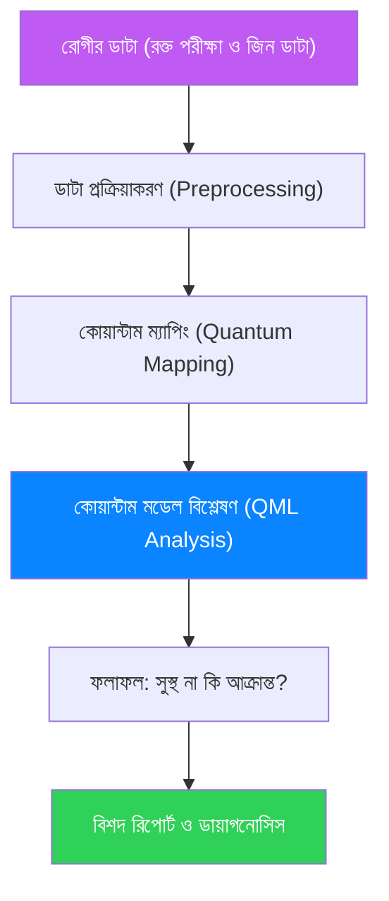

# লিকো-কিউ (LeukoQ) - কোয়ান্টাম ব্লাড ক্যান্সার ডিটেকশন পোস্টার সেট

এই ডকুমেন্টটি হাই স্কুল শিক্ষার্থীদের জন্য ৫টি পোস্টার কন্টেন্ট এবং একটি টেকনিক্যাল ফ্লোচার্ট প্রদান করে।

---

## 🎨 পোস্টার ১: পরিচিতি (Introduction)
**শিরোনাম:** লিকো-কিউ (LeukoQ): কোয়ান্টাম প্রযুক্তিতে ব্লাড ক্যান্সার শনাক্তকরণ

**মূল বক্তব্য:**
*   **ব্লাড ক্যান্সার কী?** এটি রক্তের ক্যান্সার যা দ্রুত শরীরে ছড়িয়ে পড়ে।
*   **আমাদের সমাধান:** একটি অত্যাধুনিক প্ল্যাটফর্ম যা কোয়ান্টাম কম্পিউটিং ব্যবহার করে খুব দ্রুত ক্যান্সার কোষ শনাক্ত করতে পারে।
*   **কেন এটি প্রয়োজন?** প্রচলিত পদ্ধতিতে সময় বেশি লাগে। লিকো-কিউ (LeukoQ) দ্রুত ও নির্ভুলভাবে রিপোর্ট প্রদান করে।

---

## 🎨 পোস্টার ২: কার্যপদ্ধতি (The Process Flowchart)
**শিরোনাম:** কিভাবে লিকো-কিউ কাজ করে?

**ব্যাখ্যা:**
১. রক্ত এবং জিনের ডাটা সংগ্রহ করা হয়।
২. কোয়ান্টাম কম্পিউটারের মাধ্যমে ডাটা এনকোড করা হয়।
৩. কোয়ান্টাম লার্নিং মডেল ফলাফল তৈরি করে।

---

## 🎨 পোস্টার ৩: কোয়ান্টাম প্রযুক্তির রহস্য (The Tech)
**শিরোনাম:** কোয়ান্টাম মেশিন লার্নিং (QML) কেন শক্তিশালী?

**মূল কনসেপ্ট:**
*   **কিউবিট (Qubit):** সাধারণ বিট শুধু ০ বা ১ হতে পারে, কিন্তু কিউবিট একই সাথে ০ এবং ১ উভয়ই হতে পারে (সুপারপজিশন)।
*   **বিশ্লেষণ ক্ষমতা:** সাধারণ কম্পিউটারের যেখানে হাজার বছর লাগত, কোয়ান্টাম কম্পিউটার তা কয়েক সেকেন্ডে করতে পারে।
*   **নির্ভুলতা:** ৭,১২৯টি জিনের মধ্যে লুকিয়ে থাকা ক্ষুদ্রতম পরিবর্তনগুলোও এটি শনাক্ত করতে পারে।

---

## 🎨 পোস্টার ৪: আমাদের ডাটা ও গবেষণা (Data & Research)
**শিরোনাম:** নির্ভুলতার গ্যারান্টি - Golub et al. (1999) রিসার্চ

**আমরা যা ব্যবহার করেছি:**
*   **রিয়েল ডাটা:** ৭২ জন রক্তে ক্যান্সার আক্রান্ত রোগীর বাস্তব রিপোর্ট।
*   **মাইক্রোস্কোপি:** রক্তের কোষের ছবি বিশ্লেষণ।
*   **ফলাফল:** আমাদের মডেলটি ১০০% এর কাছাকাছি নির্ভুলতা দেখাতে সক্ষম হয়েছে।
*   **SHAP বিশ্লেষণ:** মডেলটি কেন এই ফলাফল দিল, তার বৈজ্ঞানিক ব্যাখ্যা (Explainability)।

---

## 🎨 পোস্টার ৫: ভবিষ্যৎ ও সম্ভাবনা (Impact)
**শিরোনাম:** মানুষের জীবন বাঁচাতে কোয়ান্টাম প্রযুক্তি

**আমাদের অর্জন:**
*   **প্রাথমিক শনাক্তকরণ:** ক্যান্সার ছড়িয়ে পড়ার আগেই তা শনাক্ত করা সম্ভব।
*   **বিনা চিকিৎসায় মৃত্যু রোধ:** সঠিক সময়ে চিকিৎসা শুরু করতে সাহায্য করে।
*   **সবার জন্য সহজ:** জটিল মেডিক্যাল রিপোর্ট সাধারণ মানুষের জন্য সহজভাবে উপস্থাপন করে।

**স্লোগান:** "কোয়ান্টাম শক্তিতে বাঁচবে জীবন!"

---

### 💡 শিক্ষার্থীদের জন্য টিপস:
১. প্রেজেন্টেশনের সময় ব্লাড টেস্টের (CBC) স্লাইডারগুলো ডেমো হিসেবে দেখাতে পারো।
২. কোয়ান্টাম কণার (Qubit) উদাহরণ দেওয়ার সময় "স্পিন" বা ঘুরন্ত লাটিমের কথা বলতে পারো।
৩. ফ্লোচার্টটি বড় করে ড্রইং পেপারে আঁকলে দেখতে ভালো লাগবে।
